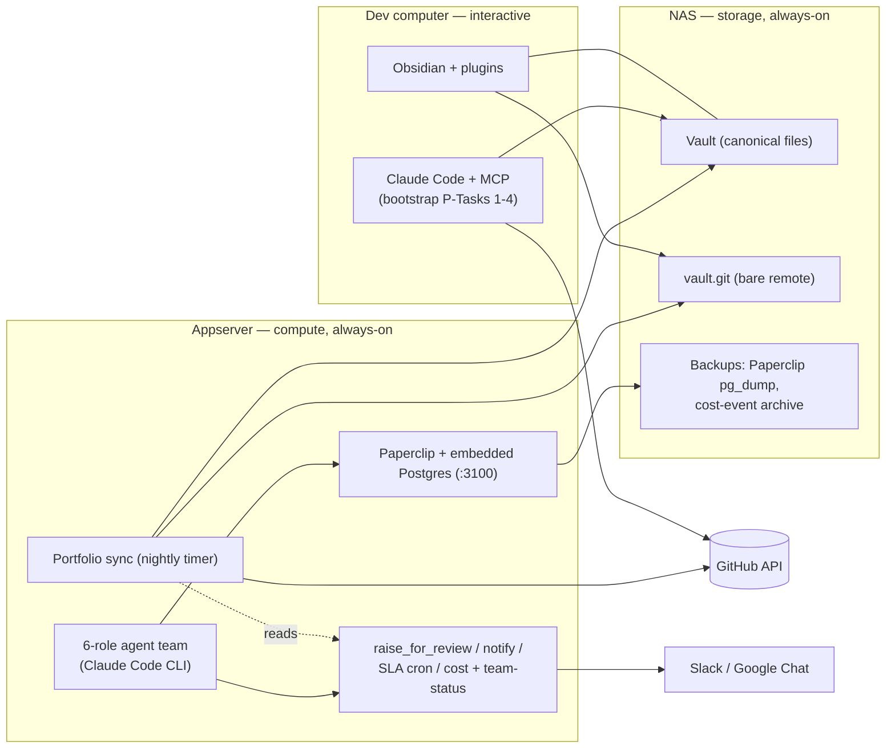

# Implementation Plan — Portfolio System + Agentic Team Harness

**Date:** 2026-07-23 · **Status:** active — decisions D1–D9 resolved 2026-07-23 (§5)
**Companions:** `portfolio/HANDOFF.md` and `harness/HANDOFF-agentic-harness.md` stay the canonical task-by-task detail; this plan sequences both, maps every component onto your three machines, and folds in the review findings from §3. Task numbers below (e.g. "P-Task 3", "H-Task 4") refer to those handoffs.

---

## 1. Deployment topology — what runs where

Three machines, three jobs: the **dev computer** is for anything interactive (Obsidian, human review passes, first test runs), the **NAS** is storage and the vault's git remote (no app compute), and the **appserver** is everything unattended and always-on (nightly sync, Paperclip, the agent team, escalation crons).

### 1.0 Ground truth from `mmackelprang/homelab` (read 2026-07-23)

The homelab repo pins down what this plan previously assumed — placement below follows its conventions:

- **Dev computer** (your note, 2026-07-23): 32 GB RAM / 32 cores / 4 TB disk / 8 GB GPU — comfortably runs several concurrent Claude sessions. It stays the *interactive* tier: bootstrap and review passes, first sync test runs, and the **manual-drive host** (pause a project's appserver agents, then drive the project here — the pause-first rule's workflow). It is deliberately **not** the agents' steady-state home: it's regularly off (as now), and the always-on appserver is where the team lives. The 8 GB GPU constrains nothing in this plan — agents are Anthropic-API-backed, and any local-model experiments would use the appserver's existing Ollama anyway.
- **Appserver** is an Ubuntu 24.04 Docker host (`mmack@appserver`, docker without sudo). Stack convention: `/srv/<stack>/` with an off-repo `.env` (mode 600), stateful data on the second disk under `/data/<stack>/` (the storage-symlink pattern). Host Caddy owns `:80`/`:443`; only explicitly published sites go public. **aiteam deploys as the `/srv/aiteam/` stack, stateful data under `/data/aiteam/`, and the Paperclip dashboard (`:3100`) stays LAN/tailnet-only — no Caddy site block.**
- **Deploys ride self-hosted GitHub Actions runners** (`/srv/gha-runners/compose.runner.yml`, one repo-scoped runner per repo, shared `FW_RUNNER_PAT`, with a commented template block for adding one). **Stage 4 adds an `appserver-aiteam` runner + a `deploy-aiteam.yml` workflow** patterned on FamilyWorkspace's `deploy-fw` (sync `/srv/aiteam/repo`, restart the sync timer / harness services). Homelab CI policy is advisory — consistent with this repo.
- **NAS** is TrueNAS SCALE (`truenas-scale`, LAN `192.168.86.47`), pool `datapool` at `/mnt/datapool` (~13 T free). The vault + `vault.git` bare remote live on a `datapool` dataset; **the appserver reaches the bare repo over the existing `ssh nas` alias, so git-as-transport needs no new NFS/SMB export** (strengthens D3). Paperclip `pg_dump`s and the cost-event archive land here too.
- **A Tailscale tailnet exists** (`taila02f52.ts.net`; the NAS is node `truenas-scale`, appserver SSH is LAN/tailnet). The off-LAN answer path for review items (F12) is the Paperclip dashboard over the tailnet. D7 is thereby answered: remote admin is possible in principle, but your access path runs through the dev computer — currently off — so Stage 0's SSH prep waits until you're home; repo/doc-side work proceeds meanwhile.
- **Homelab documentation conventions apply to every new service**: `appserver/services/<name>.md` from the template, every web UI in `DASHBOARDS.md` + the Homepage pane on the NAS, every secret a `SECRETS.md` pointer with a `SECRETS.template.md` regeneration entry, `capture.sh` re-run after changes. Stages 4–6 include these registration steps so homelab stays the disaster-recovery source of truth.

### 1.1 Component placement matrix

| Component | Runs on | Installed via | When (§4 stage) | Notes |
|---|---|---|---|---|
| Obsidian + plugins (Obsidian Git, Local REST API, Dataview, Templater; Bases core) | Dev computer | obsidian.md installer + in-app plugin browser | Stage 1 | Requires being at the machine. Enable **Obsidian Git first** (hard rule). |
| Vault (canonical files) | NAS | your existing share/sync; dev machine keeps its synced working copy | Stage 1 | Exactly one canonical copy — see F1/F2. |
| `vault.git` bare remote | NAS (`datapool` dataset) | `git init --bare` over `ssh nas` | Stage 1 | Backup + multi-writer transport (F2); appserver pulls/pushes over the existing `ssh nas` alias (§1.0). |
| Claude Code CLI + MCP connectors (github, obsidian) | Dev computer | `claude mcp add …` (`portfolio/vault-config/README.md` §3) | Stage 1 | Obsidian MCP only works while the app is open — interactive use only. |
| Python 3.10+ / Node 18+ / uv | Dev computer **and** appserver | package manager | Stage 0–1 | Appserver half is remote-doable now (D7). |
| `portfolio/bootstrap/*` (P-Tasks 1–3) | Dev computer only | this repo | Stages 1–2 | Interactive by design — human confirms pilot set and reviews drafts. |
| `portfolio/sync/*` (P-Tasks 6, 8) | Dev computer first (test runs), then appserver (container + systemd timer, nightly) | Docker + systemd/cron | Stage 3 → 4 | Appserver writes the vault via git/filesystem, **not** the Local REST API (F1). |
| `portfolio_updater/update.py` (P-Task 7) | Dev computer (Phase 0); appserver beside the agents (Phase 1+) | repo checkout | Stage 3 | The only agent write-path into notes. |
| Paperclip + embedded Postgres | Appserver — `/srv/aiteam/`, data on `/data/aiteam/` | `npx paperclipai onboard` — **pin the version** (F11) | Stage 5 | Dashboard `:3100`, LAN/tailnet only — no Caddy site block (§1.0). |
| `appserver-aiteam` GHA runner + `deploy-aiteam.yml` | Appserver (`/srv/gha-runners/`) | copy the runner template block (4 fields) | Stage 4 | The deploy mechanism for the `/srv/aiteam` stack, per homelab CI/CD conventions (§1.0). |
| Homelab registration (service doc, `DASHBOARDS.md`, Homepage, `SECRETS.md` pointers) | homelab repo + NAS Homepage | edit + `capture.sh` | Stages 4–6 | Keeps the DR docs truthful (§1.0). |
| Claude Code CLI for agents (`claude_local` adapters) | Appserver (steady-state); dev computer as optional burst/manual-drive host | installer + subscription auth (`claude login`, D5) | Stage 5 | Worktrees of the pilot repo for code-touching roles. |
| `harness/tools/*` (H-Tasks 3, 4, 6, 7) | Appserver | repo checkout | Stage 6 | notify.py needs outbound HTTPS only (one-way Phase 0/1). |
| SLA escalation + daily digest (H-Task 5) | Appserver | systemd timer/cron | Stage 6 | Must live on an always-on box, not the dev machine. |
| Cost-event log (JSONL, OTel GenAI-shaped tags) | Appserver, archived to NAS | written by agent wrapper/hooks | Stage 5–6 | Tagged project/role/task from the first event (hard rule). |
| Slack app (tokens) | Slack cloud; tokens in appserver `.env` | api.slack.com | Stage 0 (create) / 6 (use) | App creation is browser-only — **doable while away**. |
| Google Chat webhooks (per-agent, named) | Chat spaces; URLs in appserver `.env` | space settings | Stage 6 | One named webhook per team-lead/PM per space — distinct identity, one-way (F14). |
| Backups (Paperclip `pg_dump`, cost archive) | Appserver cron → NAS | cron | Stage 5 | F11 — young dependency, keep an exit ramp. |

### 1.2 Secrets by host

| Host | File | Contents |
|---|---|---|
| Dev computer | `portfolio/.env` | `GITHUB_TOKEN`, `OBSIDIAN_API_KEY`, `OBSIDIAN_VAULT_PATH` |
| Appserver | sync container env | `GITHUB_TOKEN`, `OBSIDIAN_VAULT_PATH=/mnt/vault` (no API key — filesystem/git path, F1) |
| Appserver | `harness/.env` + Paperclip secret store | Claude **subscription auth** via `claude login` (D5 — `ANTHROPIC_API_KEY` is the fallback, not the default), `SLACK_BOT_TOKEN`, `GOOGLE_CHAT_WEBHOOK_URL(s)`; `SLACK_SIGNING_SECRET` only when two-way lands (Phase 2) |
| NAS | — | none (storage only) |

---

## 2. Review scope note

Both documents already went through an adversarial review round and carry non-negotiable constraints. **Nothing below re-litigates those.** These are additions the round missed, most of them surfaced by the thing the docs never pinned down: which machine each piece actually runs on. High-severity items are folded into §4 as concrete plan steps; the rest are implementation notes for the relevant task.

---

## 3. Review findings

### Cross-cutting / topology

**F1 (High) — The nightly sync cannot depend on the Local REST API.** The REST API is served *by the Obsidian desktop app* and only while it's open on the dev computer. A nightly appserver job pointed at it fails every night the app is closed. Split the access paths: interactive Claude Code sessions use the Obsidian MCP/REST API; the **unattended sync writes the vault through the filesystem/git path** (NAS mount or clone). The handoff's "filesystem fallback" is actually the primary path for anything scheduled. → Stage 4.

**F2 (High) — The vault needs a git *remote*, not just the plugin.** Obsidian Git alone gives local history on one machine. With two writers on two machines (you + the sync job), make git the transport: bare repo on the NAS (`vault.git`); Obsidian Git on the dev computer pulls on open / pushes on change; the appserver sync job clones/pulls, commits `sync: computed fields <date>`, pushes. Concurrent edits become visible merge conflicts instead of silent file-sync clobbers, and the vault survives the loss of any single machine. (Simpler direct-NFS-write alternative in D3.) → Stages 1, 4.

**F3 (Med) — Secrets need a per-host story, and webhook URLs are secrets.** The harness handoff's §2.2 example embeds the Google Chat webhook URL (which carries `key`+`token` params) in a committed per-project YAML, while §4.6 lists it as a secret. Resolved in the scaffold: committed routing configs hold `${ENV_VAR}` references; real values live in per-host `.env`/secret stores per §1.2 above. Applies to Slack targets vs. tokens too.

**F4 (Med) — Six agents, one `stage` field: define a single caller.** Every role calling `portfolio-updater` to set `stage` invites ping-pong (research sets `research`, dev sets `development`, same day). Convention: **only the Project Lead role (or a human) sets `stage`; any role may append `changelog` entries.** One-line addition to both CLAUDE.mds when the harness team is instantiated. → Stage 5.

**F5 (Low) — Bootstrap enumeration can't run from this cloud session.** This remote session's GitHub access is scoped to `aiteam` only. P-Task 1 (enumerate all org/personal repos) runs on the dev computer where the PAT/MCP has account-wide read — or widen this cloud environment's repo scope first. → Stage 1.

### Portfolio system

**F6 (High) — "Replace only `computed:`" naively still mangles the rest of the file.** A standard YAML parse→dump rewrites the *whole* frontmatter: key order, quoting, and the schema's inline `# comments` on judgment fields get normalized away — technically only changing `computed:`, practically rewriting human territory. Require either a comment/format-preserving library (`ruamel.yaml` round-trip mode) or a **textual splice** (locate the `computed:` block's line span, replace only those lines). Strengthen the acceptance criterion from "a hand-edited `status` survives" to "**every byte outside the `computed:` span is identical**," with a test asserting exactly that. → Stage 3 (P-Task 6).

**F7 (Med) — No-op guard, or nightly commit churn.** If `last_synced` changes every run, every note gets rewritten nightly and the vault's git history becomes 20 identical commits a night, burying real changes. Only rewrite a note when something *other than* `last_synced` changed; record the global "last sync ran" timestamp once, on the dashboard note. → Stage 3.

**F8 (Med) — Decide how drafts flow through sync and dashboard.** Sync *should* refresh `computed:` on `_draft: true` notes (fresher facts help the review pass), but main dashboard views should filter drafts out, with a dedicated "Drafts awaiting review" view (sorted by `summary_confidence`, low first) as the Task 4 worklist. → Stages 2–3.

**F9 (Low) — Small mechanics to note.** `roadmap_last_updated` needs a per-file commit lookup (one extra API call per repo — fine at ~20, batch via GraphQL if rate limits ever bite). `changelog` grows unbounded on long-lived projects — no action now; revisit a "keep last N in frontmatter, archive the rest to the note body" rotation post-pilot.

### Agentic harness

**F10 (High) — Tier 0 "everything gated" + unattended heartbeats = stalled agents, unless "gated" is operationalized.** An interactive permission prompt with nobody watching just parks the agent. Make Tier 0 concrete: a **curated minimal per-role allowlist** (`.claude/settings.json` in each role's worktree — read tools, build/test commands for engineer/QA, etc.), and *everything outside the allowlist routes to `raise_for_review`* rather than waiting on a prompt. Tiers 1/2 then become defined, versioned allowlist presets in `config/trust_tiers/` — which also makes tier grants meaningful and auditable. Needs your sign-off since it interprets the trust rules (D4). → Stage 5.

**F11 (High) — Paperclip is ~6 months old and is being handed org-chart/budget/approval authority.** Contain the blast radius: **pin the installed version**, nightly `pg_dump` of its embedded Postgres to the NAS, and validate during the pilot that its budget metering roughly matches Anthropic Console numbers (the `cost_summary` rollup is the cross-check; alert at 80% of any role budget). The schema layer already keeps `review_item` Paperclip-agnostic — preserve that as the exit ramp. → Stage 5.

**F12 (Med) — Make the answer path explicit while notifications are one-way.** Phase 0/1 alerts are outbound-only, so items are *answered in the Paperclip dashboard* — meaning the "open in Paperclip" link is the primary CTA in every rendering, and answering requires being on the LAN/VPN. The two-way Slack Events endpoint (public URL, reverse proxy on the appserver) stays Phase 2, per the out-of-scope list. → Stage 6.

**F13 (Low) — Heartbeat-overhead instrumentation (handoff §9's open question).** Simplest workable answer: log tokens per heartbeat per role into the cost-event JSONL from day one (the tags from hard rule #6 already carry role), and review two weeks of pilot data before tuning any intervals. → Stage 5–6.

### F14 — Google Chat as a first-class channel, with per-agent identities

**Asked mid-review: can each agent team lead / PM have its own Google Chat name?** Yes — three tiers, in ascending weight:

1. **Named webhooks (works now, fits Phase 0/1).** A Chat space can hold *multiple* incoming webhooks, and each webhook gets its own display name and avatar at creation — so "PM · acme-billing" is one webhook and "PM · other-project" is another, each posting under its own name (with Chat's "APP" badge). Zero Google Cloud setup. Limits: one-way (post only — no replies, DMs, or button callbacks), the name is fixed per webhook (one webhook per identity, not per message), and the URL embeds its token, so it's a secret (env-var indirection per F3). Answers still happen through the Paperclip link (F12). The routing config gains a per-role webhook map — reflected in `config/notification_routing/_example.yaml` — while the single `review_item` renderer just picks the webhook by raising role, so hard rules #4/#5 stay intact.
2. **One two-way Chat app with per-agent presentation (the natural Phase 2).** A Google Chat app is one identity per app configuration, but its cards can carry per-agent headers (name + avatar per role/project) while threads, DMs, and interactive buttons all work. Key fit for your topology: Chat apps can receive events via a **Cloud Pub/Sub subscription instead of a public HTTPS endpoint** — the appserver pulls outbound-only, so no reverse proxy or port-forward on your home network. This is the deliberately-deferred two-way build (Google Cloud project + Chat API, internal-only visibility in your Workspace), still gated on your explicit go per hard rule #5.
3. **Truly separate app identities.** Either (a) one Chat app per PM — supported, but it's one Google Cloud project/app config per identity (N× setup; they can share one Pub/Sub-consuming service on the appserver), or (b) dedicated Workspace *user* accounts per PM driven via domain-wide delegation — real names, no APP badge, but paid seats, credential sprawl, and it hides that a bot is talking. Recommend against (b) on transparency grounds alone; (a) only if tier 2's styled cards prove insufficient in practice.

**Recommendation:** tier 1 lands in Stage 6 alongside Slack (per-agent named webhooks make Chat a real channel immediately); tier 2 becomes the defined Phase 2 once two-way matters; tier 3(a) only on demonstrated need. → D6 reframed accordingly.

**Placement — no separate repo or folder at any tier.** Tier 1 is pure configuration inside `harness/` (routing YAML + env vars — no new code surface). The tier-2 two-way app is a small always-on service that consumes the same `review_item` schema and renderers, so it belongs beside them: **`harness/chat_app/`**, deployed as one more container in the `/srv/aiteam` appserver stack. Only Google-side *configuration* (one GCP project, Chat API config, Pub/Sub topic + subscription) lives outside the repo, documented in `harness/docs/` when Phase 2 starts. If the subtrees ever split into two repos, `chat_app/` travels with the harness.

### F15 — Adding a project/PM must be configuration, not development

**Requirement (2026-07-23):** onboarding `new-project` should be one registration that (a) registers it with the portfolio, (b) stands up its harness team, and (c) enables comms with that project's manager/PM. The one-file-per-project convention both systems already use (vault note; `notification_routing/<project>.yaml`; `trust_tiers/<project>--<role>.yaml`; Paperclip team instantiated from the template) is exactly what makes this scriptable. Build a root-level **`bin/new-project <name> [--repo owner/name]`** wrapper that invokes each subtree's own CLI in order — subprocess calls, never imports, so the subtrees stay separable (sanctioned root-level glue; if the repos ever split, it decomposes into two commands). Runs from the dev computer or the appserver — it needs a repo checkout and the Paperclip API. What it does:

1. **Portfolio** — create the draft note (single-repo bootstrap path when a repo exists; roadmap-idea shape when pre-repo). Judgment fields stay yours: the command points you at the note to set `status` / `priority` / `target_quarter` / `summary` — deliberately manual, per hard rule.
2. **Harness** — instantiate the team from `templates/default-team.json` under Paperclip (budgets + heartbeats from the template), and write `trust_tiers/<name>--<role>.yaml` at tier 0 for every role.
3. **Comms** — write `notification_routing/<name>.yaml` with per-role env-var names pre-filled (`GOOGLE_CHAT_WEBHOOK_URL__<NAME>__PROJECT_LEAD`, …), then print the one manual step: create the named webhook(s) in the project's Chat space ("PM · <name>" — name and avatar are set at webhook creation), paste the URL(s) into `/srv/aiteam`'s env file, add the `SECRETS.md` pointer. (Webhook creation has no API — it's a ~2-minute UI step. Under Phase 2's tier-2 app this becomes "add the Chat app to the space," with no per-project Google work at all.)

Idempotent, `--dry-run`, and everything it can't do itself it prints as a short checklist. Net: a new project = **one command + judgment fields in Obsidian + one webhook paste.** → Built in Stage 6, proven in Stage 7 by onboarding a second project this way.

### F16 — Harness proposal §7 vs. hard rule #3: where review items surface on the note

The full harness proposal (received 2026-07-23) says the review queue is "pushed actively" by `raise-for-review` **appending to a capped review-queue list on the project note**. The later handoff and `harness/CLAUDE.md` hard rule #3 — and this repo's one cross-system rule — forbid exactly that: the harness never writes into the vault; only the portfolio sync job does. Treat the newer, stricter rule as controlling (it postdates the proposal and exists to keep the vault single-writer), and satisfy §7's *intent* passively: the sync job's Paperclip source (Stage 7) adds **`computed.open_reviews`** — a count plus the top pending items (id, priority, age, Paperclip link) — alongside `cost_*` and `team_status`. Same visibility on the note, no new writer; the Chat/Slack push (F14) remains the *active* channel, which is what the proposal's own §4.2 identifies as the real fix for "I miss pending items." Overrides one line of the proposal, so it's flagged for your sign-off → D9.

---

## 4. Staged plan

Stages are ordered so portfolio Phase 0 completes before the harness installs (its cost/status reporting has nothing to write into otherwise). **Stage 0 is fully doable while you're away from home.**

> **Off-site build status (2026-07-23, cloud session):** the environment-independent core is implemented and fixture-tested — portfolio: the F6 splice engine (byte-identity outside the owned span) + F7 no-op guard, portfolio-updater, sync + unclaimed-repos, bootstrap trio behind the GitHub-source seam (`--source fixture:PATH` runs everything offline); harness: `review_item` schema (+ `raised_by` per F14), raise-for-review with an honest Paperclip stub, Slack Block Kit + Google Chat Cards v2 renderers with per-role webhook selection, the OTel-tagged cost log + rollup (heartbeat overhead per F13 measurable from day one), and the seven Tier-0 allowlist presets (`harness/config/allowlists/`). **78 tests green.** Still pending on-site: live GitHub client verification (Stage 3), Paperclip client reconciliation + `team_status.py` (Stage 5), real Slack/Chat sends + allowlist syntax validation (Stages 5–6). Net effect: Stages 1–3 at home shrink from "build" to install + connect + verify-live.

### Stage 0 — now, from anywhere ✅ *(mostly done this session)*
- ✅ Repo scaffolded (Task 0 of both handoffs), this plan written.
- ✅ Decision list answered — all nine resolved (§5, 2026-07-23).
- ✅ Homelab repo read; topology grounded in its conventions (§1.0).
- ☐ SSH prep — **deferred** (D7 answered: your access path is the dev computer, currently off). First-evening-home items: Node 18+ / Python 3.10+ / uv on the appserver (Docker's already there); `git init --bare` the vault remote on a NAS `datapool` dataset. No NFS/SMB mount needed — git rides `ssh nas` (§1.0).
- ☐ Browser-doable prep: create the GitHub PAT (read scope on org + personal repos); create the Slack app and grab `SLACK_BOT_TOKEN` (`chat:write`, `channels:read`, `im:write`) — defer Events API (D6).
- ✅ `agentic-team-framework-proposal.md` received and placed at `harness/docs/proposal.md` (2026-07-23) — both systems' doc sets are now complete. It surfaced one conflict with the newer hard rules → F16 / D9.

### Stage 1 — dev computer: vault + connectors, then enumerate *(at home, ~an evening)*
1. Obsidian + vault per `portfolio/vault-config/README.md` — **Obsidian Git first**, then Local REST API (copy key), Bases check, Dataview, Templater.
2. Wire the vault to the NAS bare remote (F2): `git init` in the vault (if new), add remote, configure Obsidian Git pull-on-open / auto-commit-push.
3. Register both MCP connectors; fill `portfolio/.env`.
4. **P-Task 1** (enumerate — must run here, F5) and **P-Task 2** (filter → checklist in `bootstrap/select.md`).
5. **Gate — resolved (D1):** pilot set = **RTest, homelab, FamilyWorkspace**. Re-confirm only if enumeration surfaces a surprise.

### Stage 2 — dev computer: pilot bootstrap *(plan an afternoon for the review pass)*
6. **P-Task 3** (ingest: signals, confidence, `_draft: true` notes).
7. **P-Task 4** (human review pass — judgment fields are yours alone; drafts sorted low-confidence-first per F8).
8. **P-Task 5** (write notes to vault; Bases dashboard: by-status view, freshness/confidence view, drafts view).

### Stage 3 — dev computer: sync + updater, tested locally
9. **P-Task 6** (`sync_computed_fields.py`) with F6's byte-identity splice + test and F7's no-op guard. Prove against a throwaway note, then run manually against the pilot notes for a few days.
10. **P-Task 7** (`portfolio_updater/update.py`) + **P-Task 8** (`unclaimed_repos.py`, roadmap-idea Templater template).
11. **P-Task 9 / portfolio acceptance** (`portfolio/HANDOFF.md` §6, plus F6's stronger diff criterion). **Gate:** pilot behaves end-to-end before any rollout or harness work.

### Stage 4 — appserver: graduate the sync *(portfolio Phase 1)*
12. Stand up the `/srv/aiteam` stack per homelab conventions (repo checkout, `.env.appserver` mode 600, stateful data under `/data/aiteam/`, `SECRETS.md` pointers + template entries). Containerize `sync/`; nightly systemd timer; secrets per §1.2.
13. Vault write path per D3: clone from the NAS `vault.git` over `ssh nas`; each run commits `sync: computed fields <date>` and pushes (F1/F2).
14. Add the `appserver-aiteam` GHA runner (template block in `/srv/gha-runners/compose.runner.yml`, four fields swapped) and a `deploy-aiteam.yml` workflow patterned on `deploy-fw`; register everything in homelab (`appserver/services/aiteam.md`, `DASHBOARDS.md`, Homepage, re-run `capture.sh`). Then watch a week of nightly commits for cleanliness (F7's guard proves itself here).

### Stage 5 — appserver: Paperclip + the pilot team *(harness Phase 0 begins)*
15. **H-Task 1**: install Paperclip into the `/srv/aiteam` stack (pin the version; Postgres data under `/data/aiteam/`), confirm `:3100` (LAN/tailnet only), stand up the nightly `pg_dump` → NAS over `ssh nas` (F11); add the dashboard to homelab `DASHBOARDS.md` + Homepage.
16. Claude Code CLI + per-agent auth (D5); worktrees of the pilot repo for code-touching roles.
17. **H-Task 2**: instantiate the six-role team from `harness/templates/default-team.json` (reconcile the draft with Paperclip's real export format, budgets set, heartbeats per role) — pilot project = **FamilyWorkspace** (D2). Caution: FamilyWorkspace deploys to a **public production site** through the existing `appserver-fw` runner — at Tier 0 the Release/Deploy role's actions stay gated through review, and the `deploy-fw` workflow remains the only production path (agents propose; you approve).
18. **H-Task 8** early, per F10: Tier-0 allowlists per role in each worktree; everything outside them routes to review (D4). Trust-tier files at 0 in `config/trust_tiers/`.
19. Cost-event JSONL wiring with project/role/task tags from the first event; heartbeat token logging (F13).

### Stage 6 — appserver: review pipeline + notifications
20. **H-Task 3** (`raise_for_review.py`) and **H-Task 4** (`notify.py` — Slack Block Kit and Google Chat Cards v2 renderers; per-agent named webhooks per F14 tier 1; Paperclip link as primary CTA per F12).
21. **H-Task 5**: SLA escalation + daily digest on a systemd timer.
22. **H-Tasks 6–7**: `cost_summary.py` + `team_status.py` read-interfaces, and the one-command pause.
23. **F15**: build `bin/new-project` — one command registering a project with the portfolio, instantiating its harness team, and writing its comms config (idempotent, `--dry-run`, prints the webhook paste-step).

### Stage 7 — integration + full acceptance
24. Extend `portfolio/sync/sync_computed_fields.py` with Paperclip as a second source (`computed.cost_by_stage`, `cost_total_mtd`, `team_status`, and — per D9 — `open_reviews`) — the write stays in the portfolio subtree, per the single-writer rule.
25. **H-Task 9 / harness acceptance** (`harness/HANDOFF-agentic-harness.md` §8): real review item → rendered alerts with working links; SLA escalation fires on an intentionally-ignored low item; sane per-role costs; one-step pause visible to the next sync; no agent with `dangerouslySkipPermissions`.
26. **F15 proof:** onboard a second project purely by configuration — one `bin/new-project` run, judgment fields in Obsidian, one webhook paste. Anything that required editing code is a bug in the onboarding flow.
27. **Gate:** both acceptance checklists green → discuss rolling the portfolio out to the remaining ~15 repos and (separately, later) a second harness team.
28. *(Phase 2, on your explicit go — hard rule #5:)* the two-way Google Chat app via Pub/Sub (F14 tier 2), moving answers from the Paperclip dashboard into the Chat thread itself.

---

## 5. Decisions — all resolved 2026-07-23

Board answers, recorded here as the standing record; the affected stages reference them.

| # | Decision | Resolution (2026-07-23) |
|---|---|---|
| D1 | Pilot set of repos | **RTest** (large and deep — exercises depth), **homelab** (docs/infra repo, no app code — exercises the low-confidence/unusual-shape path), **FamilyWorkspace** (active and deployed). Bootstrap still enumerates *all* repos so the unclaimed-repos queue is real from day one. |
| D2 | Harness pilot project | **FamilyWorkspace.** Its stack already runs on the appserver with a deploy path via the `appserver-fw` runner. See the Stage 5 caution: it deploys to a **public** production site, so Tier 0 gating of the Release/Deploy role is doing real work here. |
| D3 | Appserver→vault write transport | **Git-as-transport approved:** clone/commit/push against NAS `vault.git` over the existing `ssh nas` alias (F1/F2, §1.0). |
| D4 | Tier 0 semantics | **Signed off:** Tier 0 = curated per-role allowlist in each role's worktree; everything outside it routes to `raise_for_review` (F10). Tiers 1/2 become versioned allowlist presets in `config/trust_tiers/`. |
| D5 | Anthropic auth | **Subscription-auth first:** the pilot's agents run against the monthly Claude subscription — one-time `claude login` per execution host (appserver, dev box; OAuth via SSH port-forward when home), which `claude_local` inherits. No API key to start. Cost tracking is unaffected (rule #6 tags token counts per project/role/task; dollars are notional at API list prices). Caveats: all seven agents share the account's rolling usage windows — a capped window stalls agents until reset (Max-tier headroom recommended; Pro will pinch). If caps bite or billing-grade per-role attribution is ever needed, switching to `ANTHROPIC_API_KEY` (single or per-role) is a config-only change. |
| D6 | Google Chat identity model | **As recommended (F14):** tier 1 per-agent named webhooks ship in Stage 6 alongside Slack; the tier-2 two-way app (Pub/Sub) is approved as Phase 2; tier 3 only on demonstrated need. |
| D7 | Remote reachability while away | Tailnet exists but access rides the (currently off) dev computer — SSH prep waits until home; repo/plan/browser work proceeds now (§1.0). |
| D8 | Changelog cap + confidence signals | Keep as spec'd (140-char cap, default signal table); adjust only on pilot evidence at Stage 3. |
| D9 | Review-queue visibility on the note | **Sync-job route (F16):** `computed.open_reviews` written by the portfolio sync's Paperclip source; `raise_for_review` never touches the vault. Overrides proposal §7's direct-append line. |

---

## 6. Effort sketch

Stage 1 ≈ an evening · Stage 2 ≈ an afternoon (review pass dominates) · Stage 3 ≈ 1–2 working sessions · Stage 4 ≈ one session · Stage 5 ≈ one session (plus Paperclip install-validation slack) · Stage 6 ≈ 2–3 sessions · Stage 7 ≈ one session. Claude Code does the building throughout; your required hands-on time concentrates in Stage 1 setup, the Stage 2 review pass, and the §5 decisions.
